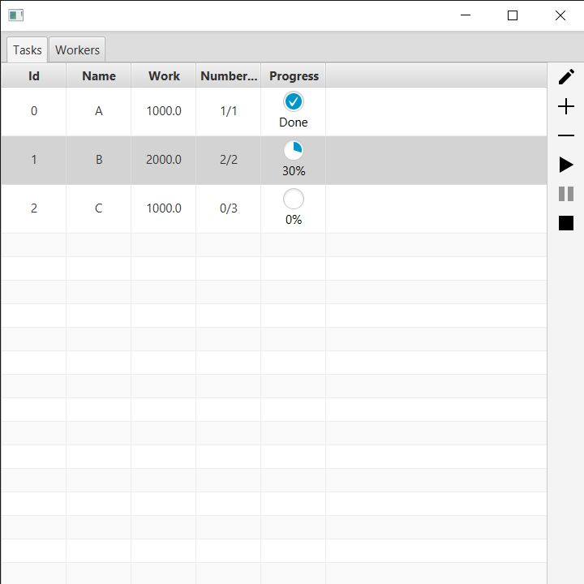
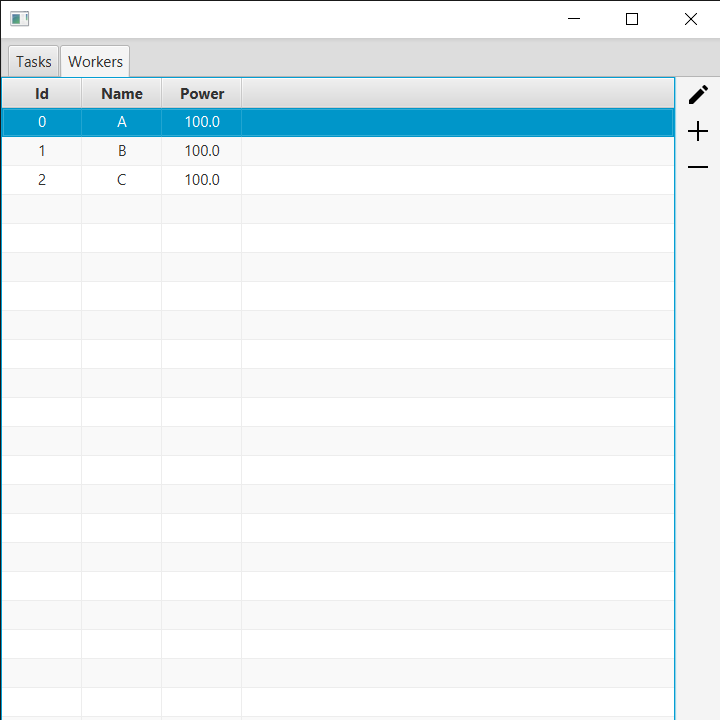
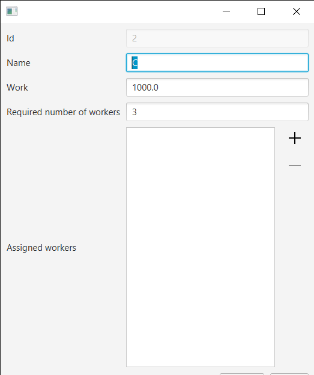
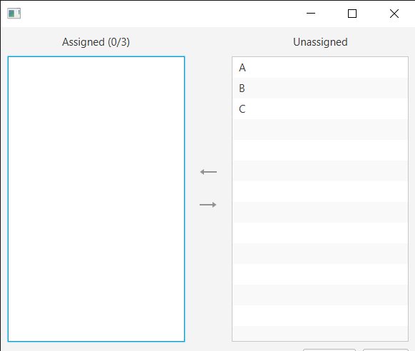
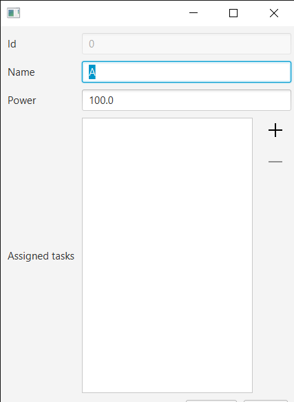
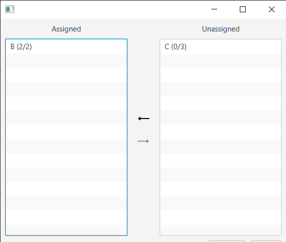

# Overview
This is a program that simulates a server that handles tasks that require a number of workers.

# The main controller/view

    

        
        
    

    <figcaption>
        

            <b>Figure 1. The view of the application.</b> The tab containing the table view of tasks (left) and the tab containing the table view of workers (right).
        

    </figcaption>

# The task's controller/view

    

        
        
    

    <figcaption>
        

            <b>Figure 2. The view of a task.</b> The task is defined as an object that requires an amount of work to be accomplished. The identifier is generated automatically, while the rest of the fields must be filled in manually by the user.
        

    </figcaption>

# The worker's controller/view

    

        
        
    

    <figcaption>
        

            <b>Figure 3. The view of a worker.</b> The worker is defined as an object that provides a quantity of work to accomplish a task. The same rules as in the task's view are applied here.
        

    </figcaption>

